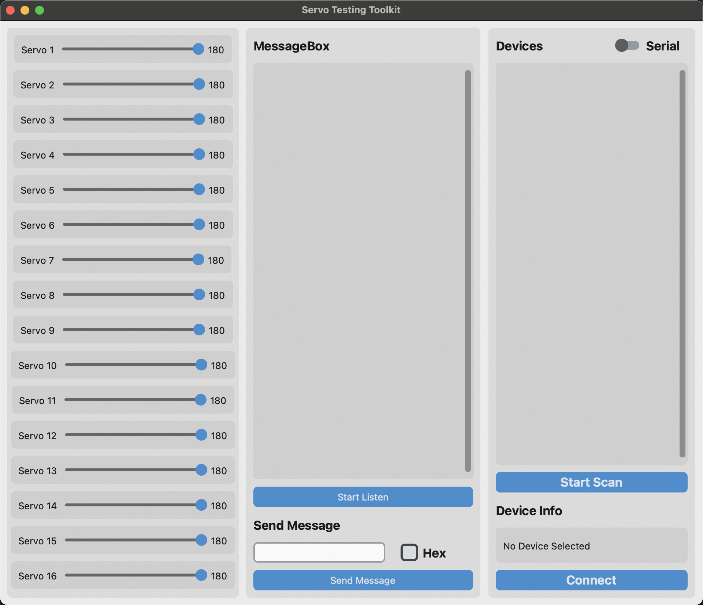

# CTK Bluetooth Servo Helper

This is a repo based on CTK(customer tkinter) and bleak to control a servo motor via bluetooth.

## Usage

1. Install the required packages

```bash
pip install -r requirements.txt
```

2. Run the program

```bash
python main.py
```

3. Select the BLE/Serial device and connect to it


